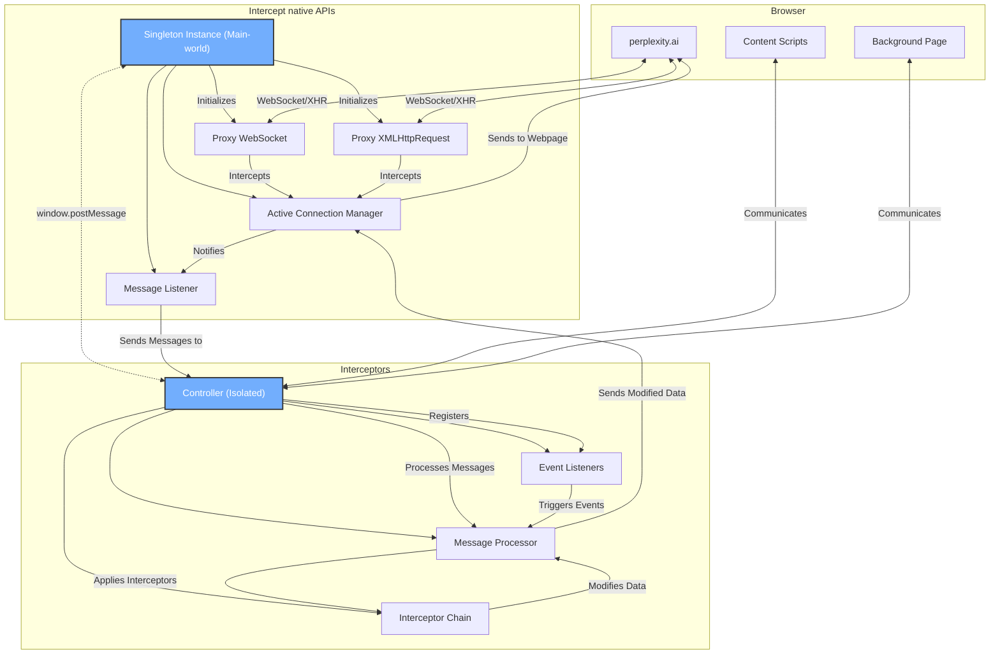

  
  <h1 style="text-align: center;">Complexity</h1>

  

    
    
    
  

  

    
    
    
    
  

An enhanced version of <a href="https://perplexity.ai/" target="_blank" style="font-weight: bold">Perplexity.ai</a> which everyone has ever wanted. Community-driven, open-source, and free to use.

  
  
  
Complexity is a third-party extension, it does NOT affiliate with Perplexity.ai.

  💖 support the development

Perplexity.ai is famously known for its LLM-based search engine, but many may not know that it is also a decent portal which provides access to various SOTA LLMs and image generation models and have somewhat a very generous rate limit compared to other services. But it lacks a lot of basic features, the UX isn't that great either. Hence, Complexity was created to fill that gap.

## Complexity is packed with features

- Various UI/UX/QoL tweaks.
- LLM/Image gen model selectors; directly chat to a collection; export your searches/conversations, etc.
- Highly customizable ADHD-friendly theme (custom css is supported).
- A dedicated solution for prompts management: Prompts Library (in development).

[Read more](https://cplx.vercel.app)

## How does it work?

This is a high-level overview of the network traffic interception approach, which provides the extension with the ability to alter the behavior of the host page.

[Read more](./docs/architecture.md)

## Installation

- [Chrome Web Store](https://chromewebstore.google.com/detail/complexity/ffppmilmeaekegkpckebkeahjgmhggpj)
- [Mozilla Add-on](https://addons.mozilla.org/en-US/firefox/addon/complexity/)
- [Releases](https://github.com/pnd280/complexity/releases)

## Build from source

1. Clone this repository
2. `pnpm clean-zip`
3. Load the extension from the zip file in the `package` folder.

The mozilla add-on version is available at the [moz](https://github.com/pnd280/complexity/tree/moz) branch.

## Limitations

- Because of frequent/unexpected changes in the host page, UI tweaks are prone to breakage and it will take some time for the review process to be passed.
- The dev runtime/overall DX on mozilla-based browsers is non-existent due to a non-compatible dev dependency [@crxjs/vite-plugin](https://github.com/crxjs/chrome-extension-tools).
- Limited testing: the e2e test suite has not been implemented due to the agressive Cloudflare protection of the host page itself (I'm still figuring out a way 🙂)

## Contributing

- Issues and PRs are welcome.
- Please follow the guidelines in [CONTRIBUTING.md](CONTRIBUTING.md).

## Acknowledgements

- [The Discord community](https://discord.gg/fxzqdkwmWx) for the constant feedbacks/suggestions and support.
- [Perplexity.ai](https://perplexity.ai/) for an amazing product. (almost 😅)
- [DailyFocus](https://github.com/Dayleyfocus) for the name "**Complexity**" and early feedbacks/testing.
- [DanielLatorre](https://www.linkedin.com/in/daniellatorre/) for the `#72AEFD` default accent color.

## Reaching out 👋

- [Discord](https://discord.gg/fxzqdkwmWx) (userid: `feline9655`)
- [pnd280@gmail.com](mailto:pnd280@gmail.com)

## Support the development 💖

- [Paypal](https://paypal.me/pnd280)
- [Ko-fi](https://ko-fi.com/pnd280)
