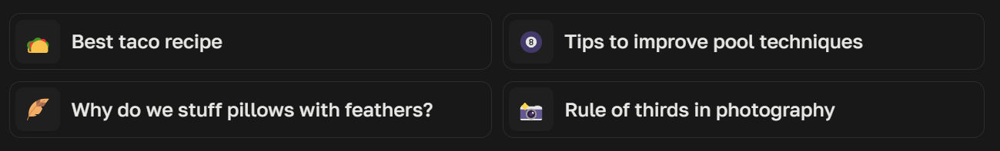

- Query box selectors:

  - [x] LLM
  - [x] Image
  - [x] Collection (without hard navigation to the collection)
  - [x] Complete control over focus mode within a conversation (will be replaced by the new "Advanced User Profile" feature)

- Advanced User Profile (simple implementation of GPTs/Assistants)

  - [ ] Prefix (sites, keywords): these will be appended to the query automatically to force PPLX to (use provided keywords) search on specific sites aka. custom **Focus** mode (🎉 yes, finally)
  - [ ] AI Prompt (Main instructions)
  - [ ] Default Chat & Image Gen Model
  - [ ] Automatically AI-generate title for threads (like OpenAI's ChatGPT)

- Better UX Tweaks:

  - [ ] Custom accent color for UI, messages's bold texts, headings, etc.
  - [ ] Custom Sans & Monospaces font
  - [ ] Anchors to quickly scroll to the answer of each message (anchors will be floated on the left; hidden on small screen). Simiar to the one on "Pages".
  - [ ] Float the side bar (images/videos/image-gen) on the right and main thread on center
  - [ ] Show selectors on follow-up querybox
  - [ ] Hide quick-ask query box on main page

  Collection right click context menu:
    - [ ] Swap collection
    - [ ] Remove from collection
    - [ ] Edit AI prompt

  Thread message right click context menu (quick actions: mostly to avoid scrolling):
    - [ ] Edit query
    - [ ] Delete
    - [ ] Automatically truncate query if it's too long (expandable): e.g. pasting a long code snippet

  Hide unnecessary stuffs:
    - [ ] Hide bloated queries on the main page
      
    - [ ] Hide the cringe slogan
      
    - [ ] Hide the "Answer" text (below the query) with a short horizontal rule
      
    - [ ] Hide "Share" buttons on every message
      

- Misc/not categorized:

  - [ ] Selected text on a message will popup an option to add them to the follow-up query box
  - [ ] Replace "Answer" text (below the query) with a short horizontal rule
  - [ ] Hide unnecessary stuffs
