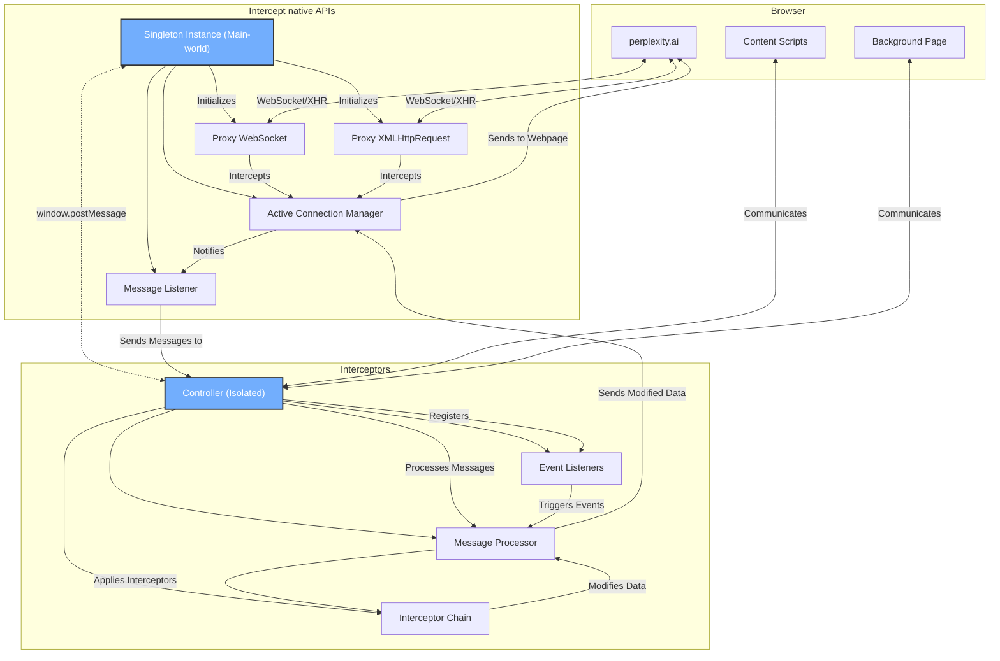

# How does Complexity work?

Complexity is a web extension that aims to enhance the user experience and functionality of Perplexity.ai.

The following implementations represent the current approach and may be subject to improvement or alternative solutions in the future.

## Intercepting Websocket Messages

Some magic like switching model/focus mode on the fly, or modifying collections, is done by intercepting the messages sent and received by Perplexity.ai's websocket connection, including the fallback to long-polling.

## Custom DOM Mutation Observer

Although all LLMs' context windows on Perplexity.ai are limited to roughly 32K, a thread/conversation can get infinitely long; there's no limit to how many messages can be sent. The performance of the page will degrade as the thread grows due to accumulated DOM mutations from MutationObserver. There have been several attempts to optimize the MutationObserver (batching, throttling, queueing, etc.), and the performance is much better than in previous iterations of Complexity.

It is shown that the latest version of Complexity can work well with a thread of ~50 messages (up from 20), but it is still recommended NOT to use that many messages in a thread.

## Communication between JS contexts

Due to the restrictions of the isolated context, content scripts in isolated contexts cannot directly access the `window` object, React fiber node data, and the Websocket class itself, which many of Complexity's features rely on. Hence, Complexity implements a simple request-response communication bridge to share data between different JS contexts (isolated <-> main-world) based on the `window.postMessage` API.

## React

Complexity's UI is rendered using React:

- TailwindCSS for styling.
- Ark-UI for headless UI components.

## Why is there `jquery` dependency?

Although it is mentioned that the project uses React, `jquery` is exclusively used for direct DOM selections and manipulations of the host page. It provides a much better developer experience (DX) than vanilla JS methods.
