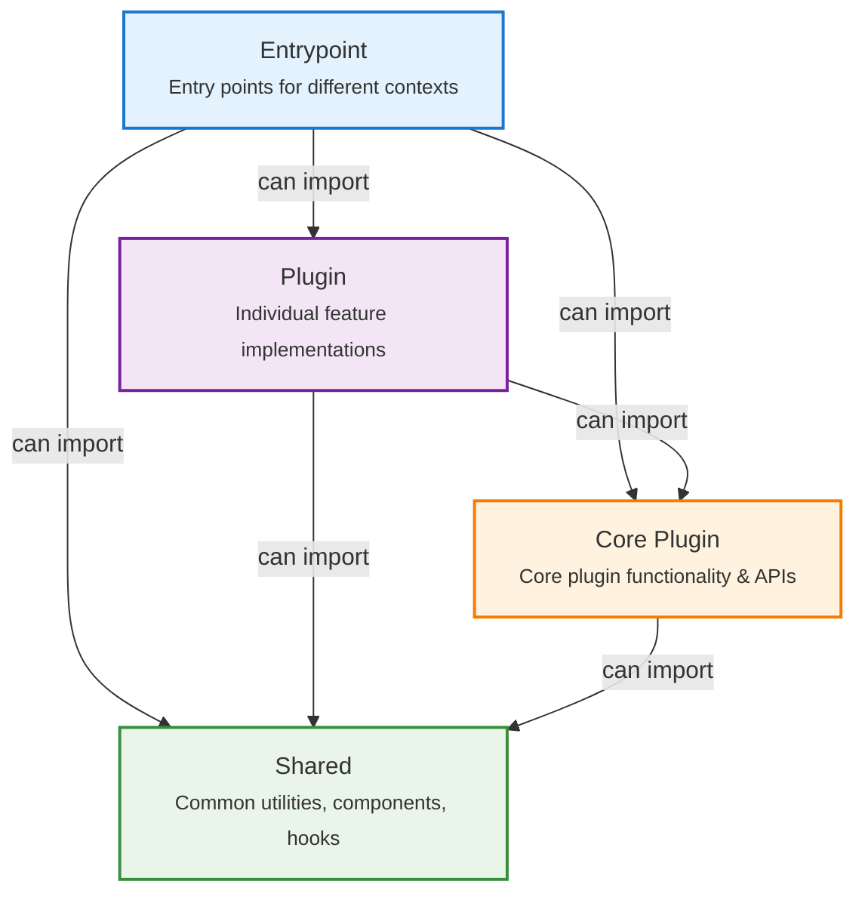

# Architecture

## At a Glance

A browser extension that provides client-side modifications to the Perplexity AI interface. Strives for clean code organization.

## Execution Contexts

The extension operates across **four execution contexts**:

- **Extension UI** - Options page (Settings Dashboard)
- **Background** - Long-running tasks, persists when UI is closed
- **Content Scripts** - Injected into Perplexity pages for functionality enhancement
- **Main-world Content Scripts** - Runs in page's document context (intercepts network requests, router, React fiber tree)

## Directory Structure

```
src/
├── assets/         # Static assets
├── components/     # Shared UI components
├── data/           # Shared data sources and constants
├── entrypoints/    # Entry points for different contexts
├── hooks/          # Shared React hooks
├── plugins/        # Modular feature implementations
│   ├── _core/      # Core plugin functionality
│   └── */          # Individual feature plugins
├── services/       # Shared services
├── types/          # TypeScript type definitions
└── utils/          # Shared utility functions
```

## Plugin System (Overview)

Modular architecture for independent feature implementation:

- **Modular**: Each plugin in its own `src/plugins/` directory
- **Discoverable**: Auto-registered via Vite's `import.meta.glob`
- **Configurable**: Enable/disable with automatic side-effect cleanup
- **Dependency-aware**: Dependent plugins auto-disabled when dependencies are disabled

### Central Registries

- [Plugin Registry](../src/data/plugin-registry/index.ts) - Core plugin definitions
- [Plugin Loaders Registry](../src/entrypoints/content-scripts/loaders.ts) - Run arbitrary code when plugin is loaded
- [Settings UI Loader](../src/entrypoints/options-page/dashboard/pages/plugins/components/plugin-settings-uis/loader.ts) - Configuration interfaces

### Module Discovery

Automatic discovery and registration via **Vite's `import.meta.glob`** for:

- Plugin implementations and async dependencies
- Background services
- Settings UI components
- Internationalization modules

> **See [Build Your Own Plugin](./build-your-own-plugin.md) for detailed structure, APIs, and examples.**

## Dependency Boundaries

The project enforces strict [dependency boundaries](../eslint-config/boundaries/index.js).

### Boundary Types

1. **Shared** - Common code including components, hooks, services, types, utils, and data
2. **Entrypoint** - Entry points for different contexts (background, content scripts, options)
3. **Core Plugin** - Core plugin functionality and APIs (`src/plugins/_core/**/*`)
4. **Plugin** - Individual feature implementations (`src/plugins/*/**/*`)
5. **Plugin Public Exports** - Public API surfaces for plugins (`src/plugins/*/**/*.public.*`)
6. **Plugin Settings UI** - Settings UI components for plugins (`src/plugins/*/**/settings-ui.tsx`)

### Import Rules

Dependency flow is strictly controlled where each boundary type can only import from allowed types. Higher layers can import from lower layers, but not vice versa. This prevents circular dependencies and maintains clean architecture.



### File Categorization

Files are categorized based on their location patterns as defined in the ESLint boundaries configuration:

- **Shared**: `src/*.ts`, `src/components/**/*`, `src/assets/**/*`, `src/hooks/**/*`, `src/services/**/*`, `src/types/**/*`, `src/utils/**/*`, `src/data/**/*`, `src/**/index.public.ts`
- **Entrypoint**: `src/entrypoints/*/**/*`
- **Core Plugin**: `src/plugins/_core/**/*`
- **Plugin**: `src/plugins/*/**/*`
- **Plugin Public Exports**: `src/plugins/*/**/*.public.*`
- **Plugin Settings UI**: `src/plugins/*/**/settings-ui.tsx`

## Data & Persistence

- **Extension Storage**: Configuration and lightweight data
- **IndexedDB**: Complex data structures and caching

## Related Docs

- [Build Your Own Plugin](./build-your-own-plugin.md) - Plugin development guide
- [Tech Stack](./tech-stack.md) - Technologies and tools overview
- [DX](./dx.md) - Development setup and workflows
