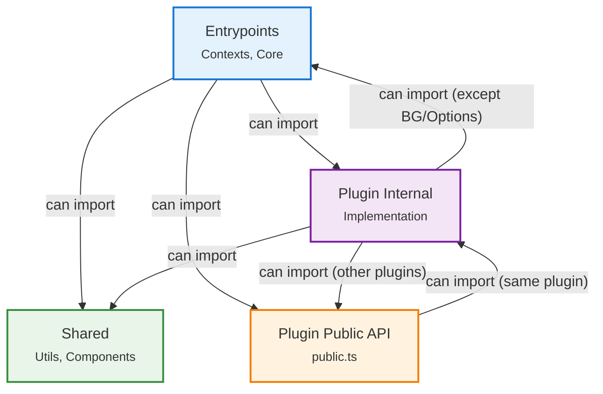

# Architecture

## At a Glance

A browser extension that provides client-side modifications to the Perplexity AI interface. Strives for clean code organization.

## Execution Contexts

The extension operates across **four execution contexts**:

- **Extension UI** - Options page (Settings Dashboard)
- **Background** - Long-running tasks, persists when UI is closed
- **Content Scripts** - Injected into Perplexity pages for functionality enhancement
- **Main-world Content Scripts** - Injected dynamically into the page's document context (intercepts network requests, router, React fiber tree)

## Directory Structure

```bash
src/
├── assets/             # Static assets
├── components/         # Shared UI components
├── entrypoints/        # Application entry points and core logic
│   ├── contexts/       # Execution contexts (Background, Content Scripts, Options)
│   ├── core-plugins/   # Core functionality plugins
│   └── registries/     # Plugin loading and registration
├── hooks/              # Shared React hooks
├── plugins/            # Modular feature implementations
│   └── */              # Individual feature plugins
├── services/           # Shared services
├── types/              # TypeScript type definitions
└── utils/              # Shared utility functions
```

- **Shared Resources**: Top-level folders (`src/*`) contain shared code usable across all execution contexts
- This structure is recursive. `src/entrypoints` and individual `src/plugins/*` contain their own internal `components`, `hooks`, and `utils` directories for encapsulated logic

## Plugin System (Overview)

Modular architecture for independent feature implementation:

- **Modular**: Each plugin in its own `src/plugins/*` directory
- **Discoverable**: Auto-registered via Vite's `import.meta.glob`
- **Configurable**: Enable/disable with automatic side-effect cleanup
- **Dependency-aware**: Modules only load when necessary

> **See [Build Your Own Plugin](./build-your-own-plugin.md) for detailed structure, APIs, and examples.**

## Dependency Boundaries

- [Dependency boundaries](../eslint-config/boundaries/index.js).
- [Auto-registered modules](./file-suffixes.md).

### Import Rules

Dependency flow is strictly controlled where each boundary type can only import from allowed types.



## Data & Persistence

- **Extension Storage**: Configuration and lightweight data
- **IndexedDB**: Complex data structures and caching

## Related Docs

- [Build Your Own Plugin](./build-your-own-plugin.md) - Plugin development guide
- [Tech Stack](./tech-stack.md) - Technologies and tools overview
- [DX](./dx.md) - Development setup and workflows
